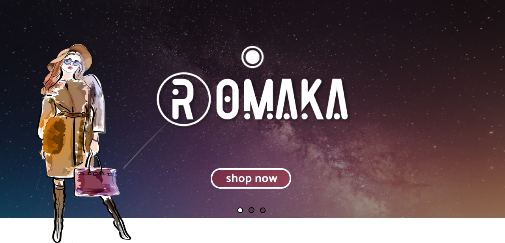

Please go under edit and edit this file as needed for your project

  

# Project Name - ROMAKA GARMENT MANAGEMENT SYSTEM 
Project Prop

# Batch - 07
### Group Leader - IT20201050 -  Y.M.D.S.M Yapa (dilki2000)
### Member 2 - IT20015244 - Wijesinghe R.M.U.S (udarasandaruwan96)
### Member 3 - IT20010744 - Madhushan S.A.H.S (EarlyBuying)
### Member 4 - IT20150334 - Gunathilaka K.M.B.P.J (Pbuddhima)
### Member 5 - IT20130848 - Jayawardena M.A.G (amanijayawardena)
### Member 6 - IT20160302 - Rajapaksha P.R.I.S (isuRuSajit)
### Member 7 - IT20151560 - Lakshan N.M.D(DILEESHA1)
### Member 8 - IT20206628 - Premasiri k.k.m.n(kkmn2000)

#### Brief Description of Project - Building an automated web based application for a garment factory which uses new technologies with nice looking User interfaces.

#### Technologies used - MERN Stack (Mongo, Express, React, Node)

Note - The student's github account should be given in brackets e.g. (IT20212232), this ideally should be your student id 

